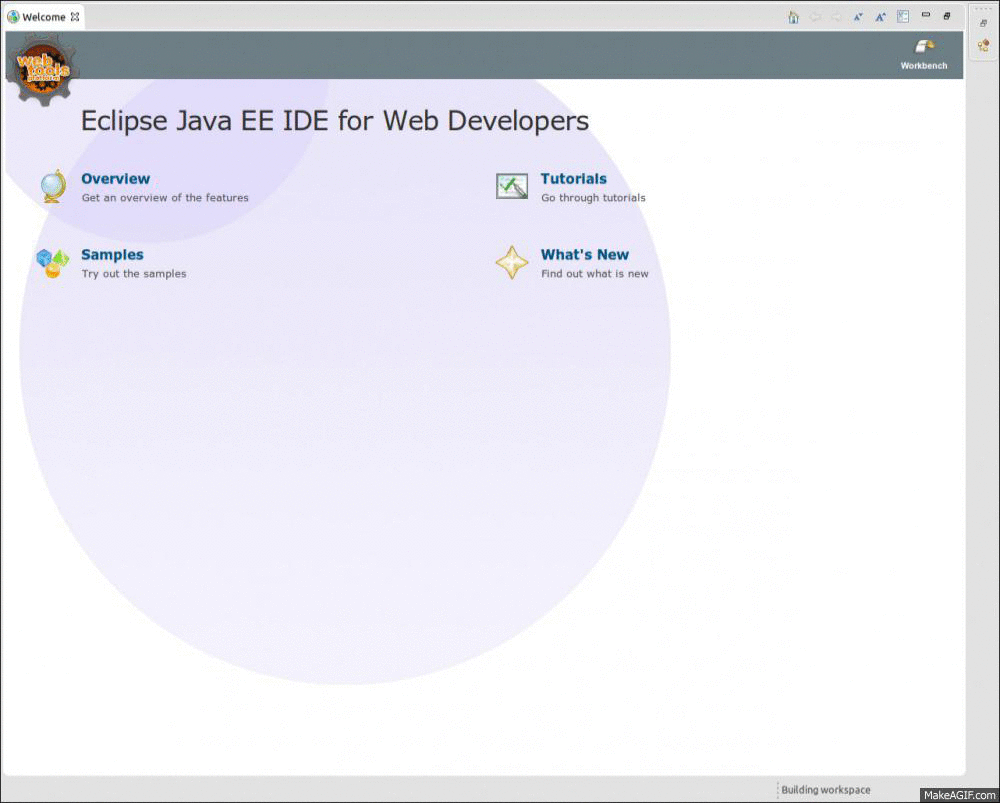

# তোমার প্রথম জাভা প্রোগ্রাম

আমরা এই চ্যাপ্টার এ যে যে বিষয়গুলো দেখবো  সেগুলো হলো-

* প্রোগ্রামিং ল্যাংগুয়েজ কি এবং কেন
* কেন জাভা
* জাভা কিভাবে কাজ করে, ভেতরের বৃত্তান্ত
* জাভা একটি কম্পাইল্ড ল্যাংগুয়েজ না ইন্টারপ্রেটেড ল্যাংগুয়েজ
* জাভা ভার্চুয়াল মেশিন কি এবং কিভাবে কাজ করে
* জাভা রানটাইম
* জাভা ডেভেলপমেন্ট কিট এবং আইডিই
* জেডিকে ইনস্টলেশন 
* একটি হ্যালো ওয়ার্ল্ড প্রোগ্রাম 

**প্রোগ্রামিং ল্যাংগুয়েজ কি ?** 

প্রোগ্রামিং ল্যাংগুয়েজ হচ্ছে এক ধরণের কৃত্রিম ভাষা যা কিনা যন্ত্র বিশেষ করে কম্পিউটার-এর আচরণ নিয়ন্ত্রণ করার জন্যে ব্যবহার করা হয়। মানুষের ভাষার মতো এর কিছু সিনট্যাক্স এবং সেম্যান্টিক্‌স অর্থাৎ নিয়মকানুন ও অর্থ থাকে।  আমাদের এই বই এর উদ্দেশ্য হচ্ছে একটি বিশেষ ভাষার(জাভা) নিয়মকানুন গুলো জেনে নেওয়া। সুতরাং পড়তে থাকুন। 

**কেন জাভা?** 

পৃথিবীতে এখন পর্যন্ত অনেক গুলো প্রোগ্রামিং ভাষা তৈরি করা হয়েছে। এদের প্রত্যেকটির উদ্দেশ্য  ভিন্ন ভিন্ন। http://en.wikipedia.org/wiki/List_of_programming_languages এখানে একটি প্রোগ্রামিং ল্যাংগুয়েজ এর একটি লিস্ট দেওয়া আছে- দেখে নেওয়া যেতে পারে। প্রত্যেকটি ল্যাংগুয়েজ এর কিছু সুবিধা অসুবিধা আছে, এবং  ল্যাংগুয়েজ গুলো প্রতিনিয়ত উন্নত হচ্ছে, এবং নতুন নতুন  ল্যাংগুয়েজ তৈরি হচ্ছে। 

যে যে কারণে জাভা শেখা যেতে পারে এখন সেগুলো নিয়ে আলোচনা করা যাক-  

- এটি খুব-ই (Readable)পাঠযোগ্য, সহজে বুঝা যায়। অন্য যে কোন প্রোগ্রামিং ব্যাকগ্রাউন্ড এর প্রোগ্রামার খুব সহজেই একটি জাভা-ফাইল দেখে বুঝতে পারবে আসলে কোড এ কি লেখা আছে।
- সি কিংবা সি++ এ কোড করার সময় আমাদের অনেক সময়-ই লিংকিং, অপটিমাইজেশান, মেমরি এলোকেশান, মেমরি ডি-এলোকেশান, পয়েন্টার ডিরেফারেন্সিং ইত্যাদি নানা রকম জিনিস নিয়ে ভাবতে হয়, কিন্তু জাভার ক্ষেত্রে এগুলোর কথা ভাবতেই হয় না। খুব বেশি চিন্তা না করে আমরা নিশ্চিতভাবে জাভা কম্পাইলার এর উপর সব কিছু ছেড়ে দিতে পারে।
- জাভাতে অসংখ্য API আছে যেগুলো খুবই স্টেবল, খুব বেশি চিন্তাভাবনা না করেই এদের নিয়ে খুব সহজেই কাজ করে ফেলা যায়।
- জাভা -র সব কিছুই ওপেন সোর্স। 
- জাভা ভার্চুয়াল মেশিন সম্ভবত সফটওয়্যার- জগতে সব থেকে চমৎকার সৃষ্টি। জাভা-এর সাথে এর আরও অনেকগুলো ল্যাংগুয়েজ যেমন- গ্রুভি, স্ক্যালা ইত্যাদি নিয়ে কাজ করা যায়।
- গত ১৫ বছরে চমৎকার অনেকগুলো ডেভেলপমেন্ট এনভায়রনমেন্ট তৈরি হয়েছে যেগুলো খুবই ইন্টেলিজেন্ট – যেমন- Eclipse, IntelliJ IDEA, netbeans etc. । এগুলো মাধ্যমে খুব আয়েশের সাথেই কোড করা যায়, ডিবাগ করা যায়।
- এটি একটি অবজেক্ট ওরিয়েন্টেড- টাইপ সেইফ প্রোগ্রামিং ল্যাংগুয়েজ।
- এটি পোর্টেবল যে কোন প্লাটফর্মে চলে। একবার কোড লিখে সেটি যে কোন মেশিনে( উইন্ডোজ , লিনাক্স , ম্যাক) চালানো যায়।
- অনেক বড় কমিউনিটি সাপোর্ট- সারা দুনিয়াতে মিলিয়নস অব জাভা প্রোগ্রামার ছড়িয়ে ছিটিয়ে আছে।
- এটির পারফরমেন্স নিয়ে বলা চলে কোন সন্দেহ নেই।
- ইন্ডাস্ট্রি গ্রেডেড, বড় বড় এন্টারপ্রাইজ অ্যাপ গুলো সাধারণত জাভা দিয়ে লেখা হয়।
- এটি পৃথিবীতে দ্বিতীয় জনপ্রিয় ল্যাংগুয়েজ- http://www.tiobe.com/index.php/content/paperinfo/tpci/index.html


এই লিস্ট এখানেই থামিয়ে দেই- কারণ এটি শেষ হতে চাইবে না কখনোই। 

**জাভা কিভাবে কাজ করে ?** 


জাভা কোডকে কম্পাইল করলে সেটি একটি অন্তর্বর্তীকালীন ল্যাংগুয়েজ এ রূপান্তরিত হয়। এটি ঠিক  হিউম্যান রিডএবল না আবার মেশিন রিডএবল ও না। একে আমরা বলি বাইট কোড। এই বাইটকোড শুধুমাত্র জাভা ভার্চুয়াল মেশিন(JVM) বুঝতে পারে। JVM বাইট কোড কে ইন্টারপ্রেট করে মেশিন ল্যাংগুয়েজ এ রূপান্তরিত করে। এর জন্যে JVM জাস্ট ইন টাইম(JIT) কম্পাইলার ব্যবহার করে। সুতরাং দেখা যাচ্ছে, জাভা কোডকে প্রথমে কম্পাইল করা হয়, তারপর সেই আউটপুট কে ইন্টারপ্রেট করা হয়। এক্ষেত্রে প্রশ্ন হতে পারে, জাভা আসলে কি? কম্পাইল্ড ল্যাংগুয়েজ নাকি ইন্টারপ্রেটেড ল্যাংগুয়েজ? উত্তর হচ্ছে জাভা একি সাথে দুটোই। 

উপরের বর্ণনা থেকে আমরা তিনটি জিনিস জানলাম - 

**১. বাইট কোড** – এটি হচ্ছে এক ধরণের ইস্ট্রাকশান সেট-  যা কিনা শুধুমাত্র জাভা ভার্চুয়াল মেশিন বুঝতে পারে। জাভা কোড ( হিউম্যান রিডএবল) অর্থাৎ আমরা যে কোড গুলো লিখবো সেগুলো কে জাভা কম্পাইলার দ্বারা কম্পাইল করলে বাইটকোড তৈরি হয়। এই বাইটকোড গুলো .class এক্সটেনশন যুক্ত বাইনারী ফাইলে স্টোর করা হয়। 
	
**২. জাভা ভার্চুয়াল মেশিন(JVM)** -  এটি মূলত একটা বাস্তব মেশিনের ভেতর একটা কাল্পনিক মেশিন। সহজ কথায়- এটি একটি সফ্টওয়্যার যা কিনা  বাইট কোড পড়ে সেগুলো মেশিন এক্সিকিউটেবল কোড-এ রূপান্তরিত করতে পারে।  JVM অনেকগুলা মেশিনের জন্যে লেখা হয়েছে- অর্থাৎ এটি উইন্ডোজ, ম্যাক OS, লিনাক্স, আইবিএম mainframes, সোলারিস ইত্যাদি অপারেটিং সিস্টেমের জন্যে আলাদা আলাদা করে লেখা হয়েছে। এর ফলে, আমরা যদি একবার কোন জাভা প্রোগ্রাম লিখি, সেটি যেকোন মেশিনে চালানো যাবে। এর কারণ আমরা এখন কোন নির্দিষ্ট মেশিনকে উদ্দেশ্য না করে শুধু মাত্র JVM কে উদ্দেশ্য করে কোড লিখি । যেহেতু সব মেশিনের জন্যেই  JVM আছে, সুতরাং আমাদের কোড সব মেশিনেই চলবে। আর এভাবেই - **“Write once, run anywhere”** বা **WORA** সম্ভব হয়েছে।  

৩. **জাস্ট ইন টাইম( JIT) কম্পাইলার** – এটি মূলত  JVM এর একটি অংশ। আমরা যে জাভা কোড কম্পাইল করার সময় তৈরি করি সেগুলো মূলত  JIT কম্পাইলার প্রসেস করে। একে dynamic translator ও বলা যায়- কারণ এটি রানটাইম-এ অর্থাৎ প্রোগ্রাম চলাকালিন সময়ে বাইটকোড প্রসেস করে। 

এবার আমরা আরও কিছু টার্মিনোলোজি(পরিভাষা) এর সাথে পরিচিত হই। 

**জাভা রানটাইম এনভায়রনমেন্ট (JRE)** –এটি মূলত একটি জাভা প্রোগ্রাম রান করার জন্যে অন্তত:পক্ষে যে সব কম্পোনেন্ট লাগে তার একটি প্যাকেজ।  এর মধ্যে থাকে JVM এবং কিছু স্ট্যান্ডার্ড এপিআই। 

**জাভা ডেভেলপার কিট (JDK)** – এটি হচ্ছে  JRE এবং জাভা কোড লেখার জন্যে যে সব টুল গুলো লাগে তার একটি সেট। জাভা প্রোগ্রাম লেখার জন্য শুধু মাত্র JDK থাকলেই চলে কারণ এর মাঝেই সব কিছু দেয়া থাকে। 

জাভার তিনটি সাবসেট আছে সেগুলো হলো - 
 
**জাভা স্ট্যান্ডার্ড এডিশন (JSE)**  
- ডেক্সটপ এবংস্ট্স্ট্যান্ড-অ্যলোন সার্ভার  এপ্লিকেশান তৈরি করার জন্যে যে সব টুল এবং এপিআই দরকার হয় সেগুলোকে আলাদা করে এর নাম দেওয়া হয়েছে জাভা স্ট্যান্ডার্ড এডিশন।

**জাভা এন্টারপ্রাইস এডিশন (JEE) **
– এটি JSE এর উপর তৈরি ওয়েব এবং অনেক বড় মাপের এন্টারপ্রাইজ এপ্লিকেশান তৈরি করার জন্যে যে সব কম্পোনেন্ট দরকার হয় সেগুলোকে আলাদা করে এর নাম দেওয়া হয়েছে  জাভা এন্টারপ্রাইস এডিশন- উদারহরণসরূপ এর কম্পোনেন্ট গুলো হচ্ছে-

- Servlets
- Java Server Pages (JSP)
- Java Server Faces (JSF)
- Enterprise Java Beans (EJB)
- Two-phase commit transactions
- Java Message Service message queue API's (JMS)
- etc.

**জাভা মাইক্রো  এডিশন (JME)** 

- এটি মূলত জাভা স্ট্যান্ডার্ড এডিশন এর সংক্ষিপ্ত  এডিশন। ইন্টারনেট অব থিংস, এমবেড ডিভাইস, মোবাইল ডিভাইস, মাইক্রোকন্ট্রোলার, সেন্সর, গেটওয়ে, মোবাইল ফোন, ব্যক্তিগত ডিজিটাল সহায়ক (পিডিএ), টিভি সেট টপ বক্স, প্রিন্টার ইত্যাদি জন্যে তৈরি জাভার এই  সংক্ষিপ্ত  এডিশন কে বলা হ্য় - জাভা মাইক্রো  এডিশন ।

এবার তাহলে জাভা চলুন জাভা ইন্সটল করে ফেলি-- 

লিনাক্স মেশিনে জাভা ইনস্টল করতে নিচের ধাপ গুলো apply করতে হবে-

- ধাপ ১: নিচের লিংক থেকে জাভা ডাউনলোড করে নিন।

[Oracle JDK 7 Download Link](http://www.oracle.com/technetwork/java/javase/downloads/index-jsp-138363.html)

- ধাপ ২: এরপর টার্মিনাল থেকে যেখানে জাভা ডাউনলোড হয়েছে সেখানে যান-

```cd ~/Download```

- ধাপ ৩: এবার JDK ইনস্টল করি-

```sudo tar -xzvf  jdk-7u21-linux-i586.tar.gz --directory=/usr/local/```
    
```sudo ln -s /usr/local/[jdk_folder_name]/ /usr/local/jdk```

jdk_folder_name - আপনার পছন্দমত একটি নাম দিন।

- ধাপ ৪: আবার টার্মিনালে ফিরে যান- .bashrc অপেন করুন।

```sudo gedit .bashrc```

- ধাপ ৫ : .bashrc ফাইল-এ নিচের লাইনটি এড করুন।

```export JAVA_HOME=/usr/local/jdk```

Save and close .bashrc file.

- ধাপ ৬: কম্পাইল .bashrc ফাইল

```source .bashrc```

- ধাপ ৭: এবার পরীক্ষা করে দেখা যাক জাভা ইনস্টল হয়েছে কিনা। আবার টার্মিনাল ওপেন করুন এবং নিচের লাইনটি টাইপ করুন।

```java -version```

যদি সবকিছু ঠিকঠাক থাকে তাহলে আপনি নিচের তথ্য গুলো দেখতে পারবেন-

```
    java version "1.7.0_65" 
    Java(TM) SE Runtime Environment (build 1.7.0_65-b17) 
    Java HotSpot(TM) 64-Bit Server VM (build 24.65-b04, mixed mode) 
```

আর উইন্ডোজ মেশিনের ক্ষেত্রে এটি আরো সহজ। এর জন্যে শুধুমাত্র JDK টি ডাউনলোড করে ডাবল-ক্লিক করেই এটি ইনস্টল করা যাবে। 

**IDE-**  

এক্ষেত্রে আমি দুটি আইডিইর কথা বলতে পারি- 
- ১. Eclipse -  https://www.eclipse.org/downloads/
- ২. IntelliJ IDEA -  http://www.jetbrains.com/idea/download/

তবে এই টিউটোরিয়ালে আমরা  Eclipse ব্যবহার করবো। 

তো চলুন- এবার তাহলে আমাদের প্রথম Hello world  প্রোগ্রামটি লিখে ফেলি। 
 ```java
    package bd.com.howtocode.java.helloworld;
    
    public class HelloWorld {
    
        public static void main(String[] args) {
            System.out.println("Hello, world!");
        }    
    }
```


