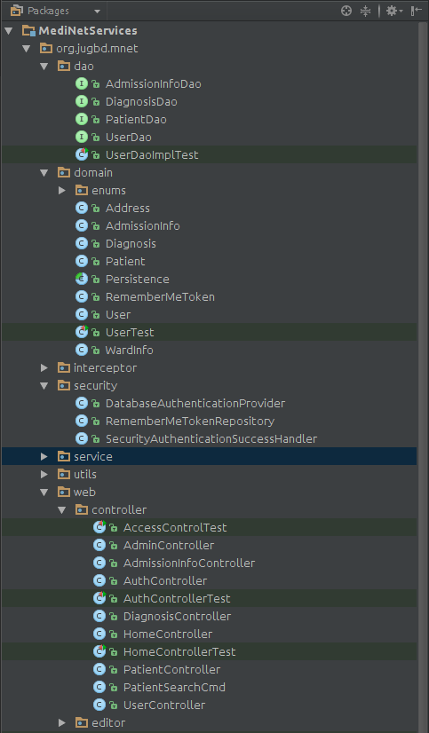

# পাঠ ২: সিনট্যাক্স

* প্যাকেজ ডিক্লেয়ারেশান
* ইম্পোর্ট
* ক্লাস
* ফিল্ডস
* মেথডস
* কন্সট্রাকটরস !!
* এক্সেস মোডিফায়ার !!
* ইন্টারফেসেস !!
* কোড ব্লকস !!
* কমেন্টস !!
* নেমিং কনভেনশান !!
* সারসংক্ষেপ  !!


এই চ্যাপ্টারে আমি একটি জাভা প্রোগ্রাম এর মৌলিক কিছু ওভারভিউ দেয়ার চেষ্টা করবো।  তবে শুরুতে সুবিধার্থে আমাদের কিছু টার্মস সম্পর্কে জেনে নেওয়া জরুরি। 

 **অবজেক্ট**
 
যেহেতু জাভা একটি অবজেক্ট ওরিয়েন্টেড ল্যাংগুয়েজ, সুতরাং শুরুতে জানতে হবে অবজেক্ট কি। অবজেক্ট  এর মানে আমারা যা জানি, সেটা হচ্ছে আমাদের জড়জগতের কোন বস্তু, যাকে ঠিক স্পর্শ করা যায়। তবে যেহেতু আমরা কল্পনা করতে পারি, আমরা অনেক কিছু ধরে নিতে পারি, মনে করুন - একটি বাইসাইকেল। বাইসাইকেল বলতেই আমদের মাথায় একটি চিত্র চলে আসে। আমরা এর বৈশিষ্টগুলো জানি, যেমন এটির দুইটি চাকা থাকে, একটি বসার সিট থাকে, এর ব্রেক আছে। তারপর এও জানি যে এটি কি করে, অর্থাৎ সাইক্যাল এর কাজ গুলোও আমরা জানি- যেমন এটি চলে। দেখা যাচ্ছে যে আমরা একটি বাইসাইকেল এর অবস্থা ও আচরণ সম্পর্কে জানি। এই  অবস্থা ও আচরণ গুলো নিয়েই বাইসাইকেল একটি অবজেক্ট। 

আমরা যদি আমাদের কল্পনাটুকু আরেকটু বাড়িয়ে নিয়ে বলি, সাইক্যাল হচ্ছে একটি সফটওয়্যার কম্পোনেন্ট যা কিনা কম্পিউটারে চলে, আমার মনে হয় কারো আপত্তি থাকার কথা নয়।  

যেহেতু আমারা প্রোগ্রামিং নিয়ে আলোচনা করছি, সুতরাং এভাবে বলি, আমরা যদি একটা প্রোগ্রাম লিখি, সেই প্রোগ্রামের ছোট্ট একটি অংশ যার আমাদের এই  বাইসাইকেল এর মতো বৈশিষ্ট্য থাকে, এবং একটি কিছু কাজ সম্পাদন করতে পারে, তাহলে সেই ছোট্ট অংশটিকে অবজেক্ট বলতে পারি। 

**ক্লাস**

মনে করি আমরা একটা বাড়ি বানাতে চাই। প্রথমে আমরা চিন্তা করি বাড়িটা আসলে কিভাবে বানাবো। আমরা জায়গা নির্বাচন করি। তারপর চিন্তা করি বাড়িটি কত-তলা হবে, কয়টা এপার্টমেন্ট হবে, এপার্টমেন্ট গুলো কত স্কয়ারফিটের হবে। তারপর চিন্তা করি, একটা এপার্টমেন্ট এ কয়টি রুম হবে, ড্রয়িং রুমের দৈর্ঘ্য কত হবে, কয়টা বাথ থাকবে, বেলকনি কোথায় থাকবে, রান্না ঘর কোথায় হবে ইত্যাদি ইত্যাদি। আচ্ছা এগুলো ঠিক হয়ে গেল, এখন আমরা চিন্তা করবো আরও জটিল কাজ নিয়ে। ওয়্যারিং নিয়ে, প্রত্যেক রুমে কয়টা পয়েন্ট থাকবে, পানির লাইন কিভাবে নেব। তারপরে বাথরুমে কি ধরণের টাইল ব্যবহার করবো, ফ্লোরে কোন গুলো। 

অর্থাৎ বাড়িটি বানানোর আগেই আমরা সব কিছু নির্ধারণ করে ফেলছি এবং আমরা এই বিষয়গুলো সব লিপিবদ্ধ করে রাখি। তারপর এই লিপিবদ্ধ লেখাগুলোকে নানাভাবে পরিক্ষা করে ক্রস চেক করে চূড়ান্ত করি। এর একটি গলাভরা নাম আছে, সেটা হচ্ছে- blueprint. 

আমাদের এক্ষেত্র বাড়টি হচ্ছে অবজেক্ট। এই অবজেক্ট বানানোর আগে আমাদের  blueprint এর দরকার হয়। আর এই  blueprint কেই আমরা বলি ক্লাস। 

আমরা তাহলে এখন অবজেক্ট এবং ক্লাস এর ধারণা জানি। এবার তাহলে আমাদের মূল বিষয় সিনট্যক্স নিয়ে কথা বলি- 

আমরা যারা সি কিংবা অন্য কোন প্রোগ্রামিং ল্যাংগুয়েজ আগে থেকেই জানি, একটি প্রোগ্রামে দুটি জিনিস অবশ্যই কমন থাকে -  সেগুলো হলো - ফাংশান এবং ডেটা ।
 
একটি জাভা প্রোগ্রাম লিখতে হলে আমাদেরকে অবশ্যএই একটি ফাইল তৈরি করতে হবে যার এক্সটেনশন হবে .java.
উদাহরণসরূপ-  HelloWorld.java
এবার আমরা লক্ষ্য করি একটি জাভা প্রোগ্রামে কি কি থাকে-  

- প্যাকেজ ডিক্লারেশন
- ইম্পোর্ট স্টেটমেন্টস
- টাইপ ডিক্লারেশন
	- ফিল্ডস
	- মেথডস

উপরের নামগুলো নিয়ে ধন্দ লাগলে সমস্যা নেই, এক্ষণি সেগুলো নিয়ে আলোচনা করছি, তবে তার আগে একটি জাভা প্রোগ্রাম দেখে নিই। 
 
 ```java
    package bd.com.howtocode.java.tutotorial.syntax;
    
    import java.util.HashMap;
    
    public class HelloWorld {
        protected final String hello = "value";
    
        public static void main(String[] args) {
        }
    }
```
     
এই কোডটির শুরুতেই আছে প্যাকেজ ডিক্লারেশন। আমরা আমাদের কম্পিউটারে নানা ধরণের ফাইল  বিভিন্ন ফোল্ডারে সাজিয়ে রাখি। যেমন- মুভি ফোল্ডারে হয়তো আমরা শুধুই মুভি রাখি, সেখানে অন্য ফাইল রাখি না। আবার মুভি ফোল্ডারে এর মধ্যে আরো সাব-ফোল্ডার তৈরি করি আরো আলাদা করার জন্যে, যেমন – বাংলা মুভি, ইংরেজি মুভি ইত্যাদি। জাভাতে  প্যাকেজ বলতে এই ধারণটিই বুঝায়। একটি জাভা প্রোগ্রামিং ভাষায় লেখা সফ্টওয়্যার এ শত শত বা হাজার হাজার  পৃথক ক্লাস থাকতে পারে। এজন্যে প্যাকেজ  ডিক্লারেশন  এর মাধ্যমে আমরা একি রকম ক্লাস গুলো একটি প্যাকেজের মধ্যে আলাদা করে রাখি। 
   

উদাহরণসরূপ এখানে প্যাকেজ স্ট্রাকচার এর একটি স্ক্রিনশট দেওয়া হল- 



প্যাকেজ নাম গুলােকে লোয়ার কেস অক্ষরে-এ লিখতে হয়। 

কোম্পানি গুলো তাদের ইন্টারনেট ডোমেইন নেইম কে উল্টো করে তাদের প্যাকেজের নাম লিখে। যেমন - example.com এর একটি প্রোগ্রামার একটি প্যাকেজের নাম লিখবে এইভাবে-  com.example.package.

আমাদের ক্ষেত্রে- 

    package bd.com.howtocode.java.tutotorial.syntax;

তারপর আমাদের প্রোগ্রামের দ্বিতীয় লাইনটি হলো - ইম্পোর্ট স্টেটমেন্টস। অন্য কোন প্যাকেজের ক্লাস যদি আমাদের প্রোগ্রামে দরকর হয় তাহলে আমারা সেটিকে এভাবে  ইম্পোর্ট করতে পারি। এটি সি প্রোগ্রামিং এর ইনক্লুড  স্টেটমেন্টস এর মতো। 

    import java.util.HashMap;

এর পরের লাইনটি হলো টাইপ ডিক্লারেশন। জাভাতে একটি টাইপ একটা ক্লাস অথবা ইন্টারফেইস অথবা এনাম হতে পারে(ইন্টারফেইস এবং এনাম নিয়ে পরে আলোচনা করা হবে)। ক্লাস ক্ষেত্রে শুরুতে class কিওয়ার্ড লিখেতে হয় তারপর  কার্লি ব্রেস { শুরু এবং শেষ } করতে হয়। আমাদের পরবর্তি প্রতিটা লাইন কোড এই কার্লি ব্রেস { } এর ভেতরে লিখতে হবে।  

    public class HelloWorld { }

এখানে অতিরিক্ত একটি  public কিওয়ার্ড দেখা যাচ্ছে। এই মুহুর্তে  শুধু মনে রাখুন ক্লাস এর শুরুতে এটি লিখতে হয়। পরে এটি নিয়ে আলোচনা করা হবে। 

এর পরেই আমরা যা দেখছি তাকে বলা হয় ফিল্ড  ডিক্লারেশন। অর্থাৎ আমরা যে বিভিন্ন রকম ভ্যারিয়্যবল ডিক্ল্যার করি, সেগুলো। 

এবং এর পরেই থাকে  মেথড। সি কিংবা অন্যান্য প্রোগ্রামিং ল্যাংগুয়েজ এ যাকে আমরা ফাংশন কিংবা সাবরুটিন বলে থাকে, এখানে আমরা সেগুলোকে  মেথড বলি। 

এক্ষেত্রে আমাদের মেথড হচ্ছে - 

    public static void main(String[] args) {
    }


এটি হচ্ছে মেইন মেথড।  জাভা প্রোগ্রামকে রান করতে হলে অবশ্যই কোন ক্লাসে একটি মেইন মেথড থাকতে হবে। 
এবার আমরা কিছু জিনিস প্রিন্ট করার চেষ্টা করি- 

জাভাতে কনসলে কিছু প্রিন্ট করার জন্যে System.out.println() অথবা  System.out.print() ব্যবহার কর হয়।


আমরা যদি নিচের প্রোগ্রমটি রান করি-
	 
 ```java
        package bd.com.howtocode.java.tutotorial.syntax;
        
        public class HelloWorld {
            public static void main(String[] args) {
                System.out.println("Hello, world!"); // Advance the cursor to the beginning of next line after printing
                System.out.println();                // Print a empty line
                System.out.print("Hello, world!");   // Cursor stayed after the printed string
                System.out.println("Hello,");
                System.out.print(" ");               // Print a space
                System.out.print("world!");
                System.out.println("Hello, world!");
            }
        }
```

তাহলে কনসলে নিচের লাইন গুলো প্রিন্ট হবে- 

    Hello, world!
    
    Hello, world!Hello,
     world!Hello, world!


**অনুশীলন:**

নিচের প্যটার্নগুলো প্রিন্ট করতে চেষ্টা করুণ- 

	* * * * *      	* * * * *    * * * * *
	* * * * *    	*       *     *     *
	* * * * *      	*       *      *   * 
	* * * * *     	*       *       * *
	* * * * *      	* * * * *        *
	   (a)            (b)          (c)
       
       
## চলবে ......

